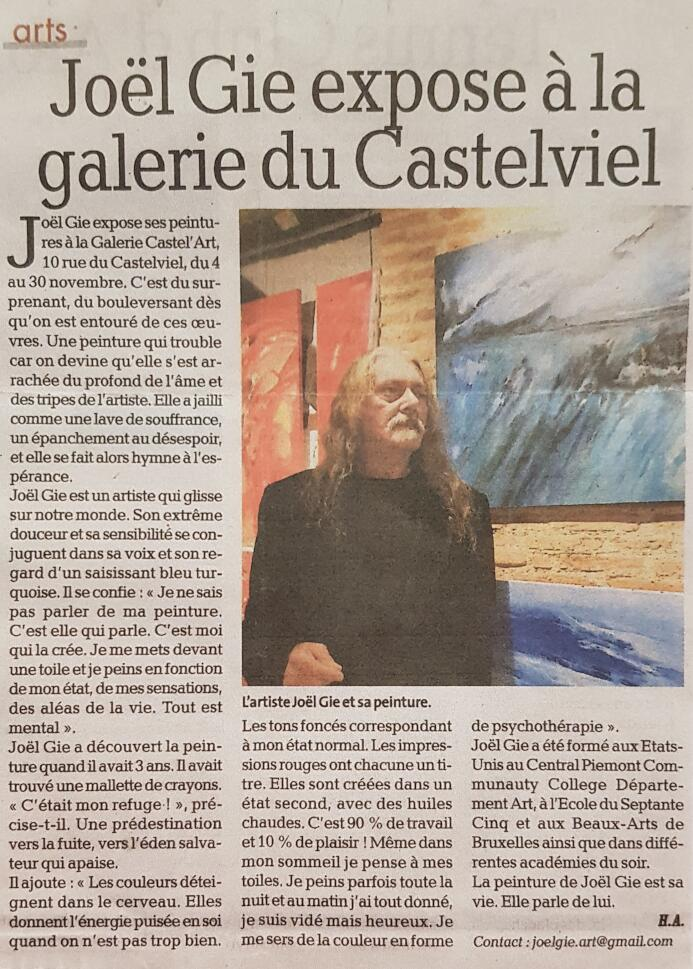
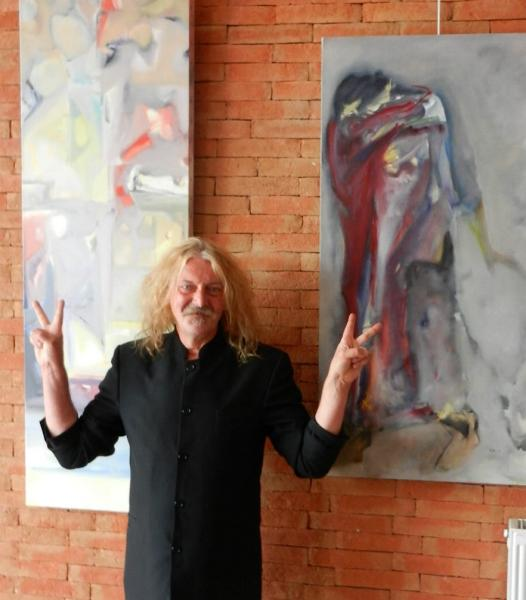

### Revue de presse

Joël GIE a exposé à la Galerie CASTEL’ART en Novembre 2019,

Formé aux Etats Unis au Central Piémont Communauty Collège Département Art, à l’Ecole  du Septente-cinq  plus les  Beaux-Arts de Bruxelles et différentes académies du soir. La peinture de Mr Gie oscille du figuratif à l’abstrait avec une parfaite maitrise des couleurs et du mouvement.

Devant la toile blanche, Mr Gie peint sans croquis, sans dessin préalable, spontanément, au gré de ses états d’âmes, de ses émotions, avec exaltation.

Une peinture sans concession, instinctive.

« Ma peinture, c’est la seule chose qui a de l’importance, elle me permet de tenir debout, elle contient toutes mes joies, toutes mes attentes, tous mes manques, toutes mes souffrances. C’est aussi une remise en cause, j’y consacre mes nuits et mes jours, un tableau peut me prendre des heures ou des semaines, au besoin, je racle, je recommence, jusqu’à obtenir l’impression que je veux faire passer, à la fin je suis vidé, exténué mais heureux. »

Une œuvre originale et forte à découvrir.

### Albi le 04/11/2019 : DISCOURS VERNISSAGE

Mesdames, Messieurs, mes Amis,

Déjà six ans depuis la dernière exposition de Joël Gie dans cette belle galerie du Castelviel.

Comme il y a six ans, Joël m’a dit, tu ne parles pas de moi et il a ajouté, tu ne parles pas de toi non plus, tu parles seulement de ma peinture.

Je ne suis pas critique d’art, mais connaissant bien la peinture de Joël, je vais tout de même essayer de vous parler de son travail et de vous donner quelques clefs de compréhensions.

Tout d’abord, vous pouvez être étonné de la quantité des œuvres exposées, 93 tableaux, travail de 6 ans et plus, exposition voulue et agencée par Joël comme une œuvre d’art en soi.

Il faut se laisser porter par l’ensemble et puis aller vers le détail, chaque toile ayant sa propre force.

Ce soir, peut être, vous ne pourrez pas tout découvrir, alors n’hésitez pas à revenir car Joël expose tout le mois de Novembre.

Quand on rentre, on est interpellés par la présence de personnages énigmatiques, de corps nus repliés sur eux-mêmes, dansant seul ou à deux.

Derrière moi quelques toiles plus douces, pastel, apaisantes, étude de l ’eau ou paysages imaginaires.

Et nous voilà dans le travail des rouges, travail commencé il y a 6 ans.

On connait le Bleu de Klein, les noirs de Soulages, mais je ne connais pas d’artistes qui se soient frottés aux rouges d’une façon aussi exhaustive.

On peut dire quelques mots sur ses toiles monochromes, sur ses camaïeux de rouges.

Le rouge est la première couleur, avec le noir et le blanc à être utilisée par l’homme depuis la nuit des temps, dans les grottes préhistoriques sous la forme d’oxyde de fer.

 Le rouge couleur « chaude » du sang et de la vie, souvent perçue comme agressive, douée d’énergie vitale et extrêmement puissante. Apparentée au feu, elle est aussi bien un signe d’amour que de guerre, et représente aussi bien la vie que la mort.

Ces tableaux ne sont pas seulement des études techniques sur la couleur rouge, ils représentent aussi les états d’âmes du peintre, parfois la colère, parfois la souffrance par laquelle il faut souvent passer pour accomplir son œuvre, pour atteindre le beau.

Dans ces œuvres abstraites, parfois apparaissent quelques éléments figuratifs, « un vase aux coquelicots », un personnage.

J’attire aussi votre attention sur les toiles monochrome jaunes, symbole de la lumière, signe de la nécessaire harmonie, apaisement au milieu de la tempête des rouges.

Enfin dans la dernière salle, après un dernier rappel des rouges qui se répondent et se renforcent jusqu’à l’étourdissement, apparaissent les bleus de Joël.

Bleus infinis du ciel ou mers déchainées avec quelques promeneurs sur un ponton soulignant la fragilité de l’homme face à la violence des éléments ou tout simplement notre propre fragilité face à notre destin.

Il y aurait beaucoup d’autre choses à dire, mais je m’arrête là pour vous laisser découvrir l’œuvre par vous-même avec vos yeux et votre sensibilité.

Je termine en te remerciant Joël pour ton œuvre, toute sortie de ton riche imaginaire, dans une grande cohérence des formes et des couleurs, œuvre originale qui je suis sûr aura le succès qu’elle mérite.                                                                       

Patrick SOULIE

### Exposition au Castelviel, Albi, 2013

«Certains par le sport, d’autre par l’art. Chaque être humain cherche à faire de sa vie une œuvre», philosophe Joël Gié. Yeux bleus, blond à la moustache. Chez ce Carmausin, dont la plastique a quelque chose de Viking, c’est via la peinture que s’exprime son besoin de création. Pour la première fois à Albi, les amateurs peuvent découvrir son univers pictural, à l’Espace du Castelviel. Jusqu’au 31 octobre, Joël Gié expose 102 huiles. Cette expo personnelle, dont le vernissage a lieu ce vendredi à 18h30, présente une large palette du savoir-faire de l’artiste.
 
«Laisser la place au rêve»

Du petit au grand format, des figures géométriques aux figures humaines, du figuratif à l’abstrait, des couleurs vives ou sombres, Joël Gié n’est pas du genre à s’enfermer dans un genre. C’est de la peinture instinctive, dont Joël Gié lui-même ne sait pas où elle va le mener. «Je ne fais pas de croquis. Je prends mon pinceau, et je peins selon l’état de mon âme et de mon humeur, pas forcément grise ou noire. Elle peut être très gaie.»

C’est aussi un investissement total. La peinture est une maîtresse exigeante et exclusive : «Ce n’est pas un plaisir, mais un travail. J’y consacre mes nuits et en partie mes jours. Un tableau peut me prendre heures ou des semaines. Au besoin, je racle et je recommence, jusqu’à obtenir l’impression que je veux faire passer. À la fin, je suis vidé. Je ne sens plus mes jambes. C’est comme un accouchement, jusqu’à en ressentir non le baby blues, mais le blues de l’artiste.» Joël Gié prend sans arrêt du recul, s’éloignant de la toile et privilégiant la vue d’ensemble, au détriment du détail. «Je m’attache très peu aux détails. Je laisse ainsi volontairement les visages flous, vaporeux, pour laisser le spectateur imaginer, combler lui-même les manques, laisser la place au rêve.»

Les premières réactions sont positives : «Les visiteurs me félicitent, me disant que ma peinture bouge les gens émotionnellement.» Pour ce peintre depuis l’âge de 3 ans, passé par l’Académie des arts de Bruxelles, l’art doit «apporter quelque chose. Il faut que le mien ait sa place.»

Espace du Castelviel, tous les jours, 10-19 heures, jusqu’au 31 octobre.

 

Alain-Marc Delbouys

​

https://www.ladepeche.fr/article/2013/10/04/1723288-albi-joel-gie-expose-au-castelviel.html

### Maison de la citoyenneté, Carmaux

Joël Gie avait à peine 3 ans lorsqu'il trébucha sur une palette de peintre couverte de belles couleurs.

Le nez dans les pigments, le petit Joël avait trouvé sa voie et sa passion, il sera artiste peintre.

Après 10 années aux Beaux-Arts de Bayonne, Joël Gie émigre aux Etats-Unis, pour suivre les cours de l'illustre Central Piedmont Communauty Collège: «J'ai alors 18 ans et j'étudie au département Art, les langues, la psycho et bien sûr la peinture, et la nuit, je fais la plonge».

A 23 ans, direction la Belgique où l'artiste pose ses pinceaux en poil de martre et son baluchon à l'école du Septantecinq, où il alterne peinture et sculpture.

De 25 à 28 ans, c'est les Beaux-Arts de Bruxelles le jour, les académies des communes Bruxelloises le soir: «Pour gagner ma vie, je fais des petits boulots, dont animateur de rue dans les quartiers défavorisés, j'apprends aux jeunes la peinture, la sculpture, la lecture».

Arrivé à Carmaux en 2002, Joël se consacre exclusivement à la peinture, créant au gré de son inspiration et de sa respiration: «Je peins comme je respire, le jour et la nuit. Je pose mon pinceau sur la toile et je peins. Mes états d'âme, ce que je ressens à ce moment là m'inspirent et me guident».

Passionné et exalté, il y a du Rimbaud chez Gie, artiste bohême, qui peint son art avec talent, posant sur la toile verticale les couleurs de la vie, celle qu'il voit, qu'il imagine, celle qu'il vit au quotidien, la peinture est sa muse: «C'est ma thérapie, un tuteur pour pouvoir rester debout. En peignant, j'exorcise mes manques».

Entre «Bulle de savon», le vase rose, «Déchirure sanguine» et le nu mélancolique, la peinture de Joël Gie est un kaléidoscope qui réfléchit à l'infini les couleurs de l'âme et de son for intérieur.

Lorsqu'il s'installe devant son chevalet, la toile est un miroir qui lui renvoie l'image et le sens de l'instant: «C'est beaucoup de remise en cause, c'est aussi une souffrance. Une peinture, c'est comme un accouchement, 90% de travail, 10 de plaisir».

En savoir plus sur https://www.ladepeche.fr/article/2012/09/15/1440488-carmaux-joel-gie-a-la-maison-de-la-citoyennete.html#mxt9BAKq3Vhbv61C.99

